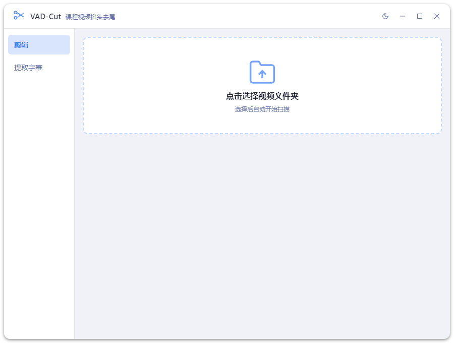

# VAD-Cut



课程视频**掐头去尾**剪辑工具。基于 Silero VAD 自动定位第一句话和最后一句话的位置，批量裁掉录屏前后的静默片段。

## 功能特性

| 功能 | 说明 |
|------|------|
| 自动剪辑 | Silero VAD 精确定位语音边界，自动去头尾静默 |
| 批量处理 | 扫描整个文件夹，最多 4 路并发 |
| 智能编码 | 自动探测 NVIDIA NVENC / AMD AMF / Intel QSV，无 GPU 时降级 CPU (libx264) |
| 画质优化 | 缩放 720p / 24fps，降噪 + 色彩均衡，输出 MP4 1500kbps |
| 字幕生成 | （可选）sherpa-onnx WASM + SenseVoice，支持中英日韩粤，输出 `.srt` |

## 支持格式

**输入：** `.mp4` `.mkv` `.avi` `.mov` `.mts` `.m2ts` `.ts` `.flv` `.wmv` `.webm` `.mpg` `.mpeg` `.m4v`

**输出：** `.mp4`

## 快速开始

```bash
# 1. 安装依赖
npm install

# 2. 下载 VAD 模型（silero_vad.onnx，约 630KB）
npm run setup

# 3. 启动
npm start
```

### 字幕功能（可选）

下载 sherpa-onnx WASM 包并解压到 `models/`：

- 下载地址：https://github.com/k2-fsa/sherpa-onnx/releases/tag/v1.12.28
- 选择文件：`sherpa-onnx-wasm-simd-1.12.28-vad-asr-zh_en_ja_ko_cantonese-sense_voice_small.tar.bz2`

解压后目录结构：

```
models/
└── sherpa-onnx-wasm-simd-1.12.28-vad-asr-zh_en_ja_ko_cantonese-sense_voice_small/
    ├── sherpa-onnx-wasm-main-vad-asr.js
    ├── sherpa-onnx-wasm-main-vad-asr.wasm
    ├── sherpa-onnx-wasm-main-vad-asr.data   # 含模型文件，约 230MB
    └── sherpa-onnx-asr.js
```

> **注意：** 模型文件较大，通过 Git LFS 管理。克隆仓库后需执行 `git lfs pull` 拉取真实文件。

## 使用方法

1. 点击中央区域，选择包含视频的文件夹
2. 按需勾选「生成字幕」
3. 点击「开始剪辑」
4. 剪辑结果保存在原文件夹下的 `剪辑/` 子目录

```
课程录屏/
├── 01.mts
├── 02.mts
└── 剪辑/
    ├── 01.mp4
    ├── 01.srt        ← 勾选字幕时生成
    ├── 02.mp4
    └── 02.srt
```

## 打包发布

```bash
npm run build
```

输出到 `dist/`（Windows ZIP 压缩包，解压即用）。

## 项目结构

```
electron/
  main.js            Electron 主进程
  preload.js         预加载脚本
renderer/            前端页面（HTML / CSS / JS）
src/
  ffmpegUtils.js     ffmpeg 封装（编码器探测、剪辑、音频提取）
  vad.js             sherpa-onnx 原生 VAD（Silero）
  asr.js             sherpa-onnx WASM ASR（字幕生成）
  processor.js       核心处理逻辑（文件扫描、并发调度）
scripts/
  download-model.js  下载 VAD 模型
  gen-icon.js        生成桌面图标
models/              模型文件（Git LFS，不含在源码中）
```

## 技术栈

- [Electron](https://www.electronjs.org/) — 桌面应用框架
- [fluent-ffmpeg](https://github.com/fluent-ffmpeg/node-fluent-ffmpeg) + [ffmpeg-static](https://github.com/eugeneware/ffmpeg-static) — 视频处理
- [sherpa-onnx](https://github.com/k2-fsa/sherpa-onnx) — 原生 VAD（Silero）+ WASM ASR（SenseVoice）
